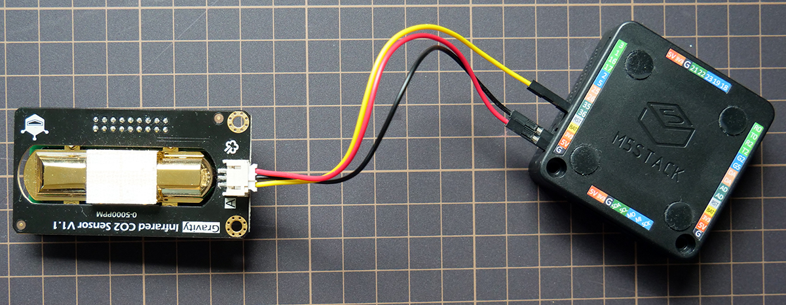

# Aircast_M5Stack


[Aircast](https://p4n.jp/works/aircast/) is open source Co2 monitoring IoT application which works on M5Stack. 

## Dependency

- [arduinojson](https://arduinojson.org/v6/doc/installation/)
- [M5Stack](https://github.com/m5stack/M5Stack)

## Hardware setup

###     hardware requirement
- [M5Stack](https://www.switch-science.com/catalog/3647/) or [M5StickC](https://www.switch-science.com/catalog/5517/)
- [Gravity Analog Infrared CO2 Sensor for Arduino](https://www.switch-science.com/catalog/4026/)
- Cables:Use what you want. we used [This](https://www.switch-science.com/catalog/2421/) 


###     hardware connection
- Connect data cable to #36 like this.
 


## how to install and run
日本語の解説は[こちら](https://raspberrypi.mongonta.com/howto-start-m5stack-arduinoide/)

1. Donwload ArduinoIDE from [here](https://www.arduino.cc/en/Main/Software) and install it in your computer
1. Set below url to **Additional Boards Manager URL** in *File / Preferences* 
    ```
    https://raw.githubusercontent.com/espressif/arduino-esp32/gh-pages/package_esp32_index.json
    ```

1. Install **esp32** by boardmanager (*tool/board/boardmanager*) 

1. Install **M5Stack** and **arduinojson** library by LibraryManager (*Sketch/Include Libraries/Manage Libraries*)

1. Select Serial Port (*Tool/Serial Port*)

1. Finally you can install this program and run by Arduino IDE.